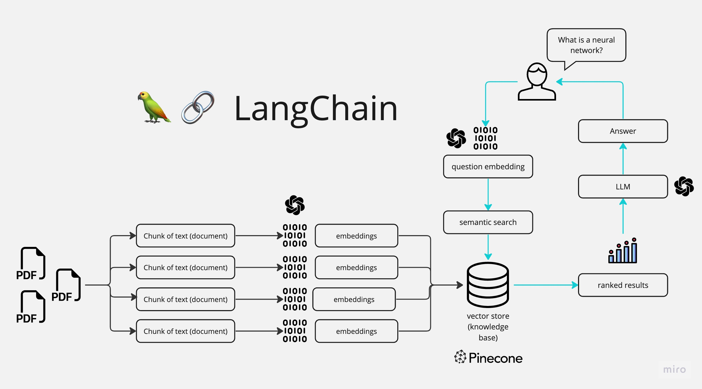

# 📚 MultiPDF Chat App

> An AI-powered chat application that lets you converse with multiple PDF documents using natural language.

## 🎯 Introduction
The MultiPDF Chat App is a Python application that enables interactive conversations with multiple PDF documents. Ask questions naturally about your PDFs, and get relevant responses based on their content using advanced AI technology. The app is context-aware and focuses solely on the content of your loaded PDFs.

## 🔄 How It Works


The application follows these steps to provide responses to your questions:

1. PDF Loading: The app reads multiple PDF documents and extracts their text content.

2. Text Chunking: The extracted text is divided into smaller chunks that can be processed effectively.

3. Language Model: The application utilizes a language model to generate vector representations (embeddings) of the text chunks.

4. Similarity Matching: When you ask a question, the app compares it with the text chunks and identifies the most semantically similar ones.

5. Response Generation: The selected chunks are passed to the language model, which generates a response based on the relevant content of the PDFs.

## 🛠️ Tech Stack
- **Frontend**: Streamlit
- **Language Model**: OpenAI GPT
- **Embeddings**: OpenAI Embeddings
- **Vector Store**: FAISS
- **PDF Processing**: PyPDF2
- **Text Splitting**: LangChain

## 🚀 Getting Started

### Prerequisites
- Python 3.8 or higher
- OpenAI API key
- Internet connection

### Installation

1. Clone the repository:
```bash
git clone https://github.com/yourusername/multipdf-chat.git
cd multipdf-chat
```

2. Create a virtual environment:
```bash
python -m venv .venv
source .venv/bin/activate  # On Windows, use `.venv\Scripts\activate`
```

3. Install dependencies:
```bash
pip install -r requirements.txt
```

4. Set up your environment:
   - Create a `.env` file in the root directory
   - Add your OpenAI API key:
```
OPENAI_API_KEY=your_api_key_here
```

## 💻 Usage

1. Start the application:
```bash
streamlit run app.py
```

2. Upload PDFs:
   - Use the file uploader in the sidebar
   - Click "Process" to analyze the documents

3. Start chatting:
   - Type your questions about the PDFs
   - Get AI-powered responses based on the document content

## 📦 Dependencies
```
langchain==0.0.184
PyPDF2==3.0.1
python-dotenv==1.0.0
streamlit==1.12.0
openai==0.27.6
faiss-cpu==1.7.4
tiktoken==0.4.0
```

## 🤝 Contributing
This repository is primarily for educational purposes. Feel free to fork and enhance the app based on your needs!

## 📄 License
This project is licensed under the [MIT License](https://opensource.org/licenses/MIT).

## ⭐️ Acknowledgments
- OpenAI for their powerful language models
- LangChain for the excellent framework
- Streamlit for the intuitive web interface

---

Made with ❤️ by chirag
